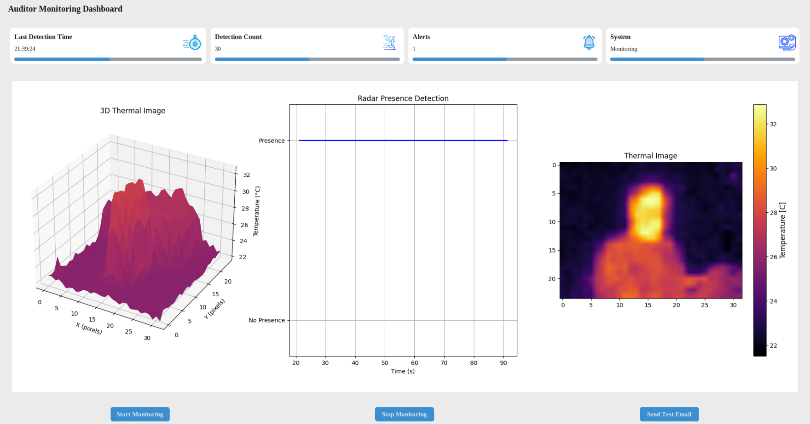

# ThermalRadar


## Overview
An advanced Fire Safety Technology combining Thermal imaging and Radar sensors with email alerting capabilities based on a Raspberry Pi Microcontroller support. This system provides real-time monitoring, data visualization, and automated alerting for human presence detection during fire events.

## Core Functionality
- **Dual-Sensor Detection**: Combines MLX90640 thermal camera and mmWave Radar sensor for accurate human presence detection
- **Real-Time Monitoring**: Live data visualization with 3D thermal imaging and radar presence plotting
- **Automated Alerting**: Email notifications with captured thermal images and radar plots
- **GUI Dashboard**: Professional CustomTkinter-based interface with real-time statistics
- **Data Logging**: Automatic saving of thermal images and sensor data with timestamps


## System Architecture

```
┌─────────────────┐    ┌──────────────────┐    ┌─────────────────┐
│   MLX90640      │    │   Radar Sensor   │    │   Email Server  │
│ Thermal Camera  │    │  (Serial UART)   │    │    (SMTP)       │
└─────────┬───────┘    └────────┬─────────┘    └─────────┬───────┘
          |I2C                  │Serial                  │Network
          │                     │                        │
    ┌─────▼─────────────────────▼────────────────────────▼─────┐
    │              Raspberry Pi / Host System                  │
    │  ┌─────────────────────────────────────────────────────┐ │
    │  │               Python Application                    │ │
    │  │  ┌─────-───────┐  ┌─────────────┐  ┌─────────────┐  │ │
    │  │  │   Sensor    │  │    GUI      │  │   Alert     │  │ │
    │  │  │  Interface  │  │  Dashboard  │  │   System    │  │ │
    │  │  └─────────────┘  └─────────────┘  └─────────────┘  │ │
    │  └─────────────────────────────────────────────────────┘ │
    └──────────────────────────────────────────────────────────┘
```
